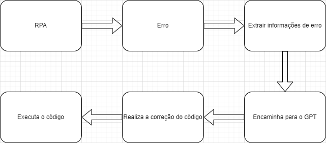

# Projeto Integrador de Inteligência Artificial

## Sobre a Equipe
- **Alexandre Hermes**
- **Gabriel Angelo Kaufmann**
- **Jefferson Barzan Alexandrino**
- **Jefferson Zeferino Pacheco**

## Sobre o Cliente
- **Empresa**: Bricker - Automação Imobiliária
- **CNPJ**: 43.689.075/0001-34
- **Localização**: São Paulo, SP

## O Problema
A **Bricker - Automação Imobiliária** enfrenta dificuldades com a instabilidade dos seus sistemas de Robotic Process Automation (RPA), que são críticos para a automação de diversos processos internos. Erros frequentes nos sistemas de RPA geram interrupções que demandam tempo e esforço manual da equipe para serem solucionados, impactando a produtividade e gerando custos operacionais adicionais. Além disso, a falta de um sistema de detecção e correção automatizada faz com que problemas simples acabem se tornando gargalos para os processos automatizados, afetando a satisfação dos clientes e a eficiência operacional da empresa.

## A Solução
Para mitigar esses desafios, propomos uma solução que integra Inteligência Artificial aos sistemas de RPA da Bricker. Essa ferramenta de IA é capaz de automatizar todo o ciclo de detecção, análise e correção de erros, minimizando a necessidade de intervenção humana e acelerando o tempo de resolução dos problemas. 

A solução utiliza uma **Large Language Model (LLM)** para analisar logs de erro e identificar rapidamente a causa dos problemas, propondo e implementando correções automáticas no sistema. Com isso, conseguimos:
### Funcionalidades da Solução
1. **Detecção de Erros**: A ferramenta monitora o sistema de RPA em tempo real, detectando erros e coletando informações relevantes.
2. **Análise de Erros**: A LLM analisa os logs de erro e o HTML da página para identificar a causa do problema.
3. **Geração de Correções**: A LLM gera código para corrigir o erro, adaptando-se ao contexto específico do problema.
4. **Implementação de Correções**: A ferramenta implementa as correções geradas pela LLM, restaurando o funcionamento do sistema.
5. **Notificação**: O Slack é notificado sobre o erro, informando se a correção foi bem-sucedida ou não.

### Benefícios da Solução
- **Redução de Custos**: A automação da resolução de erros reduz o tempo e os recursos humanos necessários para lidar com problemas.
- **Melhoria da Eficiência**: A resolução automática de erros garante a continuidade dos processos, evitando interrupções e atrasos.
- **Aumento da Qualidade**: A solução garante a precisão e a confiabilidade dos processos automatizados, reduzindo a ocorrência de erros.

## Fluxo

## Tecnologias Utilizadas
- **Python**: Linguagem de programação versátil e popular, usada para desenvolvimento web, análise de dados, automação, inteligência artificial e aprendizado de máquina, devido à sua sintaxe simples e rica variedade de bibliotecas.
- **OpenAI SDK**: Ferramenta para integrar facilmente APIs da OpenAI, como GPT e DALL-E, em aplicativos, permitindo criar soluções de inteligência artificial avançadas, como chatbots e geração de imagens.
- **python-decouple**: Biblioteca para gerenciar configurações sensíveis e variáveis de ambiente de forma segura, separando dados confidenciais do código-fonte e simplificando o gerenciamento de ambientes.
- **Pydantic**: Biblioteca para validação e parsing de dados com modelos baseados em Python, garantindo integridade e permitindo a criação de objetos bem definidos a partir de entradas externas.
- **Engenharia de Prompt**: Técnica utilizada para otimizar a interação com modelos de IA, permitindo a geração de respostas mais precisas e alinhadas às necessidades do sistema.

## Conclusão
A solução proposta oferece uma abordagem inovadora e eficiente para superar os desafios enfrentados pela Bricker em seus sistemas de RPA. Ao integrar Inteligência Artificial ao processo de resolução de erros, conseguimos automatizar tarefas que antes exigiam intervenção manual, resultando em uma operação mais ágil e confiável. 

Com a detecção e correção de falhas sendo feitas de forma automática, a Bricker pode reduzir significativamente os custos operacionais e minimizar o tempo de inatividade dos seus sistemas. Além disso, a solução garante uma maior consistência e precisão nos processos automatizados, melhorando a qualidade dos serviços prestados e aumentando a satisfação dos clientes. 
